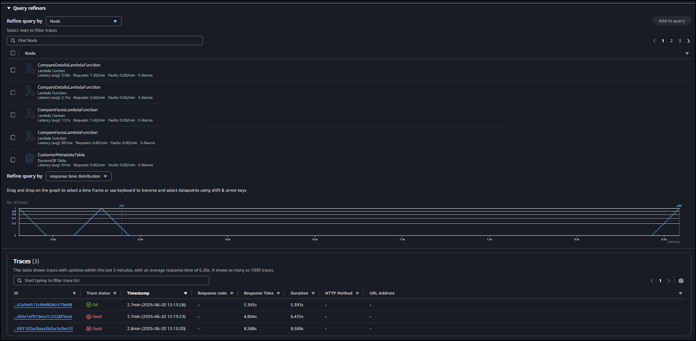
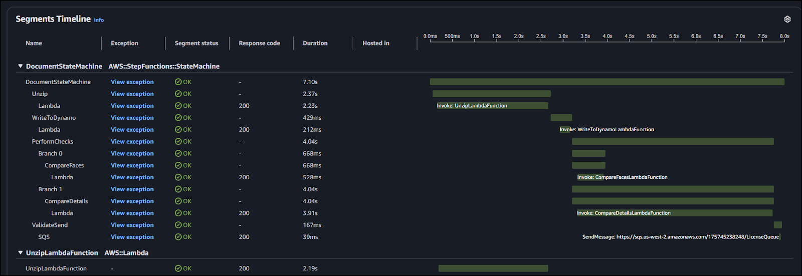
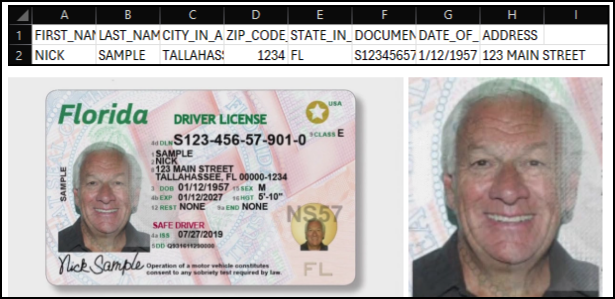

# AnyCompany Bank — Customer Onboarding (KYC) Application

A production-style, serverless pipeline that ingests customer identity document ZIP submissions, unzips and parses content, validates identity with **Amazon Rekognition** and **Amazon Textract**, orchestrates the process with **AWS Step Functions**, records outcomes in **Amazon DynamoDB**, and issues notifications via **Amazon SNS**. **Amazon SQS** decouples license validation behind **API Gateway** + Lambda. Full observability is delivered through **AWS X-Ray** and **Amazon CloudWatch**. The entire stack is defined with **AWS SAM / CloudFormation** for reproducible deployments.

---

## Authoritative Resource & Name Map

### State machine
- **Name:** `DocumentStateMachine`  
- **Role:** `DocumentStateMachineRole`  
- **States:** `Unzip` → `WriteToDynamo` → `PerformChecks` (Parallel: `CompareFaces`, `CompareDetails`) → `ValidateSend`  
- **Tracing:** **Enabled** (AWS X-Ray)

### Lambda functions
- `UnzipLambdaFunction`  
- `WriteToDynamoLambdaFunction`  
- `CompareFacesLambdaFunction`  
- `CompareDetailsLambdaFunction`  
- `SubmitLicenseLambdaFunction` *(SQS consumer → HTTP API call → DDB + SNS)*  
- `ValidateLicenseLambdaFunction` *(HTTP API backend / mock vendor)*

### Data stores & messaging
- **DynamoDB table:** `CustomerMetadataTable` (PK: `app_uuid`)  
  Flags set by the workflow:
  - `LICENSE_SELFIE_MATCH` (bool)  
  - `LICENSE_DETAILS_MATCH` (bool)  
  - `LICENSE_VALIDATION` (bool)
- **SNS topic:** `ApplicationStatusTopic`  
- **SQS queues:** `LicenseQueue`, `LicenseDeadLetterQueue`  
- **S3 bucket (logical):** `DocumentBucket`  
  - Upload prefix: `zipped/`  
  - Extracted prefix: `unzipped/`

### API
- **HTTP API logical id:** `HttpApi`  
- **Route:** `POST /license` (mock license verification endpoint)

### Environment variables (as referenced in the document)
- `INVOKE_URL` = `https://${HttpApi}.execute-api.us-east-1.amazonaws.com/prod/license`  
- `TABLE` = `CustomerMetadataTable`  
- `TOPIC` = `ApplicationStatusTopicArn`  
- `QUEUE_URL` = `arn:aws:sqs:us-east-1:${AWS::AccountId}:LicenseQueue`  
- `BUCKET` = `DocumentBucket`  
- `APP_UUID` = generated at runtime

> **Table name note:** the source shows both `CustomerMetadataTable` and `CustomerMetaDataTable`. The **canonical deployed resource** is `CustomerMetadataTable`. Env var `TABLE` uses that exact name to avoid runtime errors.

> **SQS URL note:** the document sets `QUEUE_URL` to an **ARN**. If your code calls `send_message(QueueUrl=...)`, AWS expects a **Queue URL**, not an ARN. If you see `InvalidAddress`, substitute the real Queue URL from stack outputs.

---

## Workflow

1. **Upload** ZIP to **S3** under `zipped/`.  
2. **EventBridge** rule detects `ObjectCreated` on the bucket/prefix and **starts `DocumentStateMachine`**.  
3. **Unzip** — `UnzipLambdaFunction` downloads the ZIP to `/tmp`, extracts, deletes the archive (≤512MB guard), and writes artifacts to **`unzipped/`**.  
   - Emits `$.application` with `app_uuid`, `selfie_key`, `license_key`, and `details_file`.  
4. **WriteToDynamo** — `WriteToDynamoLambdaFunction` fetches **`unzipped/{app_uuid}_details.csv`**, parses the **first (only) row**, then writes the item to **`CustomerMetadataTable`** keyed by `app_uuid`.  
5. **PerformChecks (Parallel)**  
   - **CompareFaces** — `CompareFacesLambdaFunction` uses **Rekognition** to compare selfie vs license photo; writes `LICENSE_SELFIE_MATCH`.  
   - **CompareDetails** — `CompareDetailsLambdaFunction` uses **Textract** to extract **name/DOB/address** and compare to CSV; writes `LICENSE_DETAILS_MATCH`.  
   - If **either** branch fails or mismatches → **execution fails** (no SQS message).  
6. **ValidateSend** — `arn:aws:states:::sqs:sendMessage` sends a message to **`LicenseQueue`** with `app_uuid` and license details **only if both checks passed**.  
7. **SubmitLicense** — `SubmitLicenseLambdaFunction` (SQS consumer) calls **`INVOKE_URL`** (HTTP API `POST /license`) → `ValidateLicenseLambdaFunction` (mock vendor) → updates **DynamoDB** `LICENSE_VALIDATION` and publishes **SNS**.  
8. **Observability** — **X-Ray tracing** enabled for the state machine and key Lambdas; **CloudWatch** logs everywhere. **AWS Lambda Powertools** tracer may be used in code.

---

## Architecture Overview

```text
Customer uploads ZIP
        |
        v
   Amazon S3 (zipped/)
        |
        v   EventBridge: ObjectCreated -> StartExecution
+--------------------------------+
|   DocumentStateMachine         |   **Tracing:** X-Ray
|   **StartAt:** Unzip           |
|   Unzip(Lambda)                |   Extracts -> unzipped/
|   WriteToDynamo(Lambda)        |   Writes base record to DynamoDB
|   PerformChecks(Parallel)      |
|  ├─CompareFaces(Lambda)        |  --> LICENSE_SELFIE_MATCH
|  └─CompareDetails(Lambda)      |  --> LICENSE_DETAILS_MATCH
|   ValidateSend(SQS sendMessage)|  <-- only if both True
+--------------------------------+
        |
        v
 Amazon SQS (LicenseQueue)  [DLQ on failures]
        |
        v
 SubmitLicenseLambdaFunction (SQS consumer)
        |
 HTTP API (API Gateway /prod/license)
        |
        v
 ValidateLicenseLambdaFunction  (mock vendor)
        |
        v
 Amazon DynamoDB  <── writes LICENSE_VALIDATION
        |
        v
 Amazon SNS  ──> Email notification
```

---

## State Machine Definition (high level)

```yaml
StartAt: Unzip
States:
  Unzip:
    Type: Task
    Resource: UnzipLambdaFunction.Arn
    ResultPath: $.application
    Next: WriteToDynamo

  WriteToDynamo:
    Type: Task
    Resource: WriteToDynamoLambdaFunction.Arn
    ResultPath: $.notification
    Next: PerformChecks

  PerformChecks:
    Type: Parallel
    Branches:
      - StartAt: CompareFaces
        States:
          CompareFaces:
            Type: Task
            Resource: CompareFacesLambdaFunction.Arn
            End: true
      - StartAt: CompareDetails
        States:
          CompareDetails:
            Type: Task
            Resource: CompareDetailsLambdaFunction.Arn
            End: true
    Next: ValidateSend

  ValidateSend:
    Type: Task
    Resource: arn:aws:states:::sqs:sendMessage
    Parameters:
      QueueUrl: <LicenseQueue URL or ARN per your env var>
      MessageBody:
        app_uuid.$: $.application.app_uuid
        selfie_key.$: $.application.selfie_key
        license_key.$: $.application.license_key
    End: true
```

**Tracing**: `Tracing.Enabled: true` on the state machine.  
**Logging**: CloudWatch Logs (ALL states, include execution data).

---

## Deployment (SAM / CloudFormation) — `us-east-1`

### Prerequisites

```bash
aws configure        # region: us-east-1
sam --version
python --version
```

### Build & Deploy

```bash
sam build
sam deploy --guided
# Stack Name: kyc-app
# Region: us-east-1
# Allow SAM CLI IAM role creation: y
# Save arguments to samconfig.toml: y
```

### Capture Outputs

- `BucketName` — the S3 bucket for intake  
- `StateMachineArn` — Step Functions ARN  
- `HttpApiInvokeUrl` — ends with `/prod/license`  
- `QueueUrl` — SQS queue URL (use this if your code calls SQS with QueueUrl)  
- `TableName` — `CustomerMetadataTable`

---

## Environment Variables

| Function | Variable | Value |
|---|---|---|
| `UnzipLambdaFunction` | `BUCKET` | `DocumentBucket` |
| `WriteToDynamoLambdaFunction` | `TABLE` | `CustomerMetadataTable` |
| `CompareFacesLambdaFunction` | — | Uses S3 keys from state input (`$.application`) |
| `CompareDetailsLambdaFunction` | — | Uses S3 keys from state input (`$.application`) |
| `SubmitLicenseLambdaFunction` | `INVOKE_URL` | `https://${HttpApi}.execute-api.us-east-1.amazonaws.com/prod/license` |
|  | `TABLE` | `CustomerMetadataTable` |
|  | `TOPIC` | `ApplicationStatusTopicArn` |
|  | `QUEUE_URL` | `arn:aws:sqs:us-east-1:${AWS::AccountId}:LicenseQueue` *(document shows ARN; swap to Queue **URL** if SDK requires)* |

---

## Testing & Expected Results:

### Sample-1: full success
```bash
ZIP=8d247914.zip
aws s3 cp "$ZIP" "s3://<BucketName>/zipped/$ZIP"
```
- **Step Functions** execution: **SUCCEEDED**  
- **DynamoDB** item fields:  
  - `LICENSE_SELFIE_MATCH=True`  
  - `LICENSE_DETAILS_MATCH=True`  
  - `LICENSE_VALIDATION=True`  
- **SNS**: onboarding email delivered  
- **X-Ray**: trace shows state durations and Lambda subsegments

### Sample-2: face mismatch → fail at `CompareFaces`
```bash
ZIP=9c358026.zip
aws s3 cp "$ZIP" "s3://<BucketName>/zipped/$ZIP"
```
- Execution **FAILED** at **CompareFaces**  
- DynamoDB: `LICENSE_SELFIE_MATCH=False`  
- No SQS send; no `LICENSE_VALIDATION`

### Sample-3: details mismatch → fail at `CompareDetails`
```bash
ZIP=7a135804.zip
aws s3 cp "$ZIP" "s3://<BucketName>/zipped/$ZIP"
```
- Execution **FAILED** at **CompareDetails**  
- DynamoDB: `LICENSE_DETAILS_MATCH=False`  
- No SQS send; no `LICENSE_VALIDATION`

---

## Observability: (CloudWatch & X-Ray)

- **State machine:** `Tracing.Enabled: true`; CloudWatch logging of **ALL** states with execution data.  
- **Lambdas:** `Tracing: Active`; IAM includes:
  - `xray:PutTraceSegments`
  - `xray:PutTelemetryRecords`

**Powertools Tracer** (optional, recommended):

```python
from aws_lambda_powertools import Tracer
tracer = Tracer()

@tracer.capture_lambda_handler
def lambda_handler(event, context):
    # business logic ...
    return {"status": "ok"}
```

---

## Security:

- **S3**: TLS-only bucket policy, **SSE-S3** encryption, public access blocked.  
- **IAM**: one role per Lambda; Step Functions role can `lambda:InvokeFunction`, `sqs:SendMessage`, and write X-Ray traces.  
- **DynamoDB**: permissions scoped to `CustomerMetadataTable`.  
- **SQS/SNS**: DLQ configured; in production add **KMS CMKs** for SQS, SNS, DDB, and S3.  
- **API Gateway**: mock endpoint; add authentication/authorization before integrating a real vendor.

---

## Troubleshooting:

- **No workflow execution**  
  - Check **EventBridge rule** bucket name and `zipped/` prefix; confirm the target is your `DocumentStateMachine`.  
- **SQS not consumed**  
  - Verify the event source mapping on `SubmitLicenseLambdaFunction`; inspect the **DLQ** for poison messages.  
- **X-Ray gaps**  
  - Confirm tracing is enabled on the state machine and Lambdas; verify IAM includes `xray:Put*`.  
- **Rekognition/Textract AccessDenied**  
  - These APIs often require `"Resource": "*"`. Narrow scoping too early will break calls.  
- **Queue ARN vs URL**  
  - If your Lambda calls `send_message(QueueUrl=...)`, you must pass a **Queue URL**, not an ARN.

---

## Hardening for Production:

- Replace any broad managed policies with **least-privilege statements**.  
- Add **Step Functions Catch/Retry** with `ResultPath` and fallback routes (e.g., to DLQ).  
- Use **KMS CMKs** for SQS, SNS, S3, and DynamoDB.  
- Add **CloudWatch Alarms** + **EventBridge** rules for failure notifications and automated remediation.  
- Add **Cognito** for authenticated uploads and scoped access.  
- Export audit data to **S3** and analyze with **Athena/Glue** if required.

---

## Workflow Frames:

### Frame 1 — S3 Upload Detected (zipped/)
EventBridge rule captures ObjectCreated on the bucket `DocumentBucket` with prefix `zipped/` and starts the `DocumentStateMachine`. Verify the event detail shows the correct object key.


### Frame 2 — State Machine: StartAt Unzip
Execution graph shows entry into `Unzip` (Task → `UnzipLambdaFunction`). The function downloads the ZIP to `/tmp`, extracts, and writes objects under `unzipped/`.


### Frame 3 — Unzip Output → Application Context
`UnzipLambdaFunction` returns `$.application` containing `app_uuid`, `selfie_key`, `license_key`, and `details_file` S3 keys for downstream states.


### Frame 4 — WriteToDynamo
`WriteToDynamoLambdaFunction` parses the first row of the CSV (`unzipped/{app_uuid}_details.csv`) and persists a new item in `CustomerMetadataTable` keyed by `app_uuid`.


### Frame 5 — PerformChecks (Parallel)
Parallel state runs `CompareFaces` and `CompareDetails` concurrently. Either failure short-circuits the workflow and prevents SQS send.


### Frame 6 — CompareFaces → Rekognition Result
`CompareFacesLambdaFunction` calls Rekognition to compare the selfie and license images. Writes `LICENSE_SELFIE_MATCH` to DynamoDB.


### Frame 7 — CompareDetails → Textract Result
`CompareDetailsLambdaFunction` uses Textract to extract name/DOB/address from the license image and compares to CSV. Writes `LICENSE_DETAILS_MATCH`.


### Frame 8 — ValidateSend → SQS
On dual success, `ValidateSend` uses `arn:aws:states:::sqs:sendMessage` to post a message to `LicenseQueue` with `app_uuid`, `selfie_key`, and `license_key`.


### Frame 9 — SQS Consumer → API Gateway → ValidateLicense
`SubmitLicenseLambdaFunction` consumes the queue message, calls `INVOKE_URL` (HTTP API `POST /license`), updates DynamoDB `LICENSE_VALIDATION`, and publishes `ApplicationStatusTopic`.


### Frame 10 — Success Path & Final Record
Execution completes successfully. Verify Step Functions status, X-Ray trace, and the DynamoDB item showing all three flags set to `True` for the PASS sample.


---

