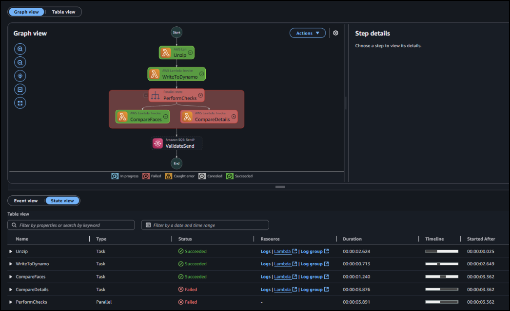
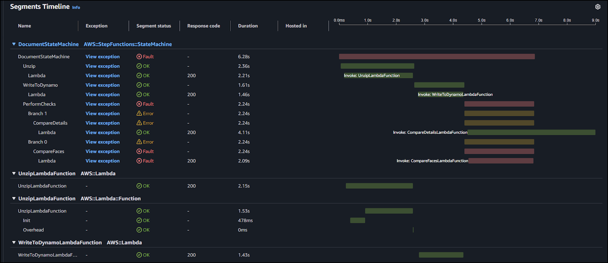

# AnyCompany Bank — Customer Onboarding Application

## Overview
This application automates the customer onboarding process by validating customer-provided documents through a secure, serverless workflow. The system processes identity documents, compares facial images, and verifies personal information before submitting validated applications to the next stage.

## How It Works


### Simple Workflow

1. **Document Upload**: Customer uploads a ZIP file containing:
   - A selfie image
   - A photo ID/license
   - A CSV file with personal details

2. **Document Processing**:
   - System unpacks the ZIP file and organizes the contents
   - Customer information is stored in a database
   - Two verification checks run simultaneously:
     - Face comparison between selfie and ID photo
     - Verification that ID details match submitted information

3. **Validation & Submission**:
   - If both checks pass, application moves to final verification
   - External system validates the license information
   - Customer receives notification about application status

## Key Resources

- **Storage**: Documents are stored in Amazon S3
- **Database**: Customer information is stored in DynamoDB
- **Processing**: AWS Lambda functions handle each workflow step
- **Orchestration**: Step Functions coordinate the entire process
- **Notifications**: Email notifications sent via SNS

## Verification Steps

1. **Identity Match**: Confirms the selfie matches the photo on the ID
2. **Details Match**: Verifies text on ID matches submitted personal information
3. **License Validation**: Validates license information with verification service

The system maintains a complete audit trail and handles failures gracefully with appropriate error handling and dead-letter queues for troubleshooting.

## Monitoring

The application includes comprehensive logging and tracing to monitor performance and troubleshoot any issues that might arise during the onboarding process.

## Customer Onboarding Workflow — Valid & Invalid Runs (with References)

This guide shows **exact console screenshots** for both **valid** and **invalid** customer document uploads through the serverless KYC pipeline.

It highlights:
- the **entire Step Functions state machine** on a success path and two failure paths,
- the **S3 upload** to the `zipped/` prefix and the extracted results in `unzipped/`, and
- the **DynamoDB table** items that prove outcomes.


## 1) State Machine — Full Success Execution

A valid submission traverses all states and ends **SUCCEEDED**.


**What to verify**
- `Unzip` → `WriteToDynamo` → `PerformChecks` (**CompareFaces**, **CompareDetails**) → `ValidateSend` (SQS).  
- No red failure nodes; overall status **SUCCEEDED**.
- X‑Ray tracing is enabled; links visible in execution details.
- If subscribed to the SNS topic via email, confirmed that a notification was received with:

   - Subject: License photo validation SUCCEEDED

   - Message: License photo validation SUCCEEDED

     
     


## 2) State Machine — Failure Paths

### 2.1 Face Mismatch → **CompareFaces** fails


**Expected outcome**
- Execution **FAILED** in `CompareFaces`.  
- No `ValidateSend` to SQS.  
- DynamoDB has `LICENSE_SELFIE_MATCH` set **False**; `LICENSE_VALIDATION` is **absent** (not attempted).
- If subscribed to the SNS topic via email, confirmed that a notification was received with:

   - Subject: License photo validation FAILED

   - Message: License photo validation FAILED

     
     


### 2.2 Details Mismatch → **CompareDetails** fails





**Expected outcome**
- Execution **FAILED** in `CompareDetails`.  
- No `ValidateSend` to SQS.  
- DynamoDB shows `LICENSE_DETAILS_MATCH` **False**; `LICENSE_VALIDATION` **absent**.
- If subscribed to the SNS topic via email, confirmed that a notification was received with:

   - Subject: License photo validation FAILED

   - Message: License photo validation FAILED

     


## 3) S3 Document Intake

### 3.1 Upload ZIP to `zipped/`


**What to verify**
- Your `.zip` object appears under `zipped/`.  
- EventBridge rule targets the Step Functions state machine.

### 3.2 Unzipped Artifacts


**What to verify**
- `unzipped/` contains the **selfie image**, **license image**, and **`{app_uuid}_details.csv`**.


## 4) DynamoDB Results


---


## Deployment: (SAM/CloudFormation)

### Prerequisites:

```bash
aws configure        
sam --version
python --version
```

### Build & Deploy:

```bash
sam build
sam deploy --guided
# Stack Name: kyc-app
# Region: us-east-1
# Allow SAM CLI IAM role creation: y
# Save arguments to samconfig.toml: y
```

### Capture Outputs:

- `BucketName` — the S3 bucket for intake  
- `StateMachineArn` — Step Functions ARN  
- `HttpApiInvokeUrl` — ends with `/prod/license`  
- `QueueUrl` — SQS queue URL (use this if your code calls SQS with QueueUrl)  
- `TableName` — `CustomerMetadataTable`


## Environment Variables:

| Function | Variable | Value |
|---|---|---|
| `UnzipLambdaFunction` | `BUCKET` | `DocumentBucket` |
| `WriteToDynamoLambdaFunction` | `TABLE` | `CustomerMetadataTable` |
| `CompareFacesLambdaFunction` | — | Uses S3 keys from state input (`$.application`) |
| `CompareDetailsLambdaFunction` | — | Uses S3 keys from state input (`$.application`) |
| `SubmitLicenseLambdaFunction` | `INVOKE_URL` | `https://${HttpApi}.execute-api.us-east-1.amazonaws.com/prod/license` |
|  | `TABLE` | `CustomerMetadataTable` |
|  | `TOPIC` | `ApplicationStatusTopicArn` |
|  | `QUEUE_URL` | `arn:aws:sqs:us-east-1:${AWS::AccountId}:LicenseQueue` *(document shows ARN; swap to Queue **URL** if SDK requires)* |


## Observability: (CloudWatch & X-Ray)

- **State machine:** `Tracing.Enabled: true`; CloudWatch logging of **ALL** states with execution data.  
- **Lambdas:** `Tracing: Active`; IAM includes:
  - `xray:PutTraceSegments`
  - `xray:PutTelemetryRecords`

**Powertools Tracer** (optional, recommended):

```python
from aws_lambda_powertools import Tracer
tracer = Tracer()

@tracer.capture_lambda_handler
def lambda_handler(event, context):
    # business logic ...
    return {"status": "ok"}
```


## Security:

- **S3**: TLS-only bucket policy, **SSE-S3** encryption, public access blocked.  
- **IAM**: one role per Lambda; Step Functions role can `lambda:InvokeFunction`, `sqs:SendMessage`, and write X-Ray traces.  
- **DynamoDB**: permissions scoped to `CustomerMetadataTable`.  
- **SQS/SNS**: DLQ configured; in production add **KMS CMKs** for SQS, SNS, DDB, and S3.  
- **API Gateway**: mock endpoint; add authentication/authorization before integrating a real vendor.


<-- ## Troubleshooting: 

- **No workflow execution**  
  - Check **EventBridge rule** bucket name and `zipped/` prefix; confirm the target is your `DocumentStateMachine`.  
- **SQS not consumed**  
  - Verify the event source mapping on `SubmitLicenseLambdaFunction`; inspect the **DLQ** for poison messages.  
- **X-Ray gaps**  
  - Confirm tracing is enabled on the state machine and Lambdas; verify IAM includes `xray:Put*`.  
- **Rekognition/Textract AccessDenied**  
  - These APIs often require `"Resource": "*"`. Narrow scoping too early will break calls.  
- **Queue ARN vs URL**  
  - If your Lambda calls `send_message(QueueUrl=...)`, you must pass a **Queue URL**, not an ARN. --> 


<-- ## Hardening for Production:

- Replace any broad managed policies with **least-privilege statements**.  
- Add **Step Functions Catch/Retry** with `ResultPath` and fallback routes (e.g., to DLQ).  
- Use **KMS CMKs** for SQS, SNS, S3, and DynamoDB.  
- Add **CloudWatch Alarms** + **EventBridge** rules for failure notifications and automated remediation.  
- Add **Cognito** for authenticated uploads and scoped access.  
- Export audit data to **S3** and analyze with **Athena/Glue** if required. --> 

## 🔍 AWS X-Ray Tracing — End-to-End Visibility

This section explains how X-Ray traces the full onboarding run — from the S3-triggered state machine through parallel checks, SQS handoff, API call, and final database/notification writes.

### Frame X1 — Service Map Overview (End-to-End Trace)

- **What you should see:** Node for **Step Functions**, child **Lambda** nodes, and AWS service nodes: **Rekognition**, **Textract**, **SQS**, **API Gateway**, **DynamoDB**, **SNS**. The **Parallel** validation typically dominates latency.


### Frame X2 — Step Functions Segment & Child States

- **Details:** Root segment is the `DocumentStateMachine` execution with child subsegments: `Unzip`, `WriteToDynamo`, `PerformChecks` (Parallel), `ValidateSend`. Failed runs show a red child state where it stops.


### Frame X3 — UnzipLambdaFunction Trace Details

- **Checks:** S3 `GetObject` → unzip in `/tmp` → S3 `PutObject` to `unzipped/`. Ensure AWS SDK subsegments appear if instrumentation is enabled.


### Frame X4 — WriteToDynamoLambdaFunction Trace (PutItem)

- **Checks:** S3 `GetObject` for CSV, then **DynamoDB `PutItem`** to `CustomerMetadataTable` with `app_uuid` PK.


### Frame X5 — Parallel Checks Segment (CompareFaces & CompareDetails)

- **Details:** Two concurrent child segments: **CompareFacesLambdaFunction** and **CompareDetailsLambdaFunction**. Any failure stops before SQS.


### Frame X6 — Rekognition Subsegment (CompareFaces)

- **Checks:** AWS SDK subsegment for **`Rekognition.CompareFaces`** (~80% threshold in code). Verify response metadata, similarity, and duration.



### Frame X7 — Textract Subsegment (AnalyzeID) (CompareDetails)

- **Checks:** **`Textract.AnalyzeID`** to read license fields; longer latency is normal.


### Frame X8 — Step Functions → SQS SendMessage Task

- **Checks:** `arn:aws:states:::sqs:sendMessage` task with message ID visible in logs; X-Ray shows the AWS call subsegment.


### Frame X9 — SubmitLicenseLambdaFunction → HTTP API call

- **Checks:** SQS event → outbound **HTTP API** call (`POST /license`) to `execute-api`. Confirm status code and latency subsegment.


### Frame X10 — ValidateLicenseLambdaFunction → DynamoDB + SNS

- **Checks:** **DynamoDB** update of `LICENSE_VALIDATION` and **SNS Publish** to `ApplicationStatusTopic`.


---
© 2025 Levi Breedlove – MIT License Amazon Web Services
